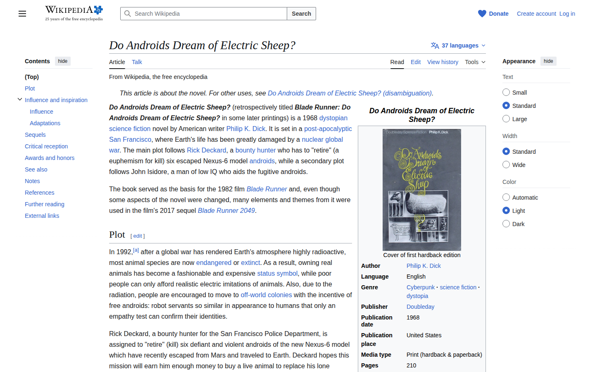

# update-screenshots-action

[](https://github.com/Mrchazaaa/update-screenshots-action/actions/workflows/tests.yml)
[](https://github.com/Mrchazaaa/update-screenshots-action/actions/workflows/build.yml)

A publishable GitHub Action that captures a site as either a static PNG or an animated GIF, writes it to a repo-relative path in the checked-out workspace, and updates a marked block in a Markdown file.

## Demo

This repository uses the action itself to keep the screenshot below up to date.

<!-- screenshot:start -->

<!-- screenshot:end -->

## What It Does

- Opens a caller-provided URL in Chromium via `playwright-core`
- Captures either a PNG screenshot or an animated GIF using a fixed viewport
- Rewrites a marked block in the target README to point at the captured asset path

The action can optionally commit and push its managed changes back to the currently checked-out branch.

## Required README Markers

The target Markdown file must contain this exact marker pair:

```md
<!-- screenshot:start -->

<!-- screenshot:end -->
```

Everything between those markers is replaced with a single Markdown image reference that points at the action's `capture_path` input.

To update multiple screenshots in the same Markdown file, run the action multiple times with different `marker_name` values and matching marker pairs such as `<!-- hero:start --> ... <!-- hero:end -->` and `<!-- dashboard:start --> ... <!-- dashboard:end -->`.

## Usage

```yaml
name: Update screenshot

on:
  workflow_dispatch:
  schedule:
    - cron: "0 9 * * *"

jobs:
  update-screenshot:
    runs-on: ubuntu-latest
    steps:
      - uses: actions/checkout@v4
        with:
          persist-credentials: true

      - uses: Mrchazaaa/update-screenshots-action@v1
        with:
          url: https://example.com
          capture_path: assets/screenshots/home.png
          marker_name: screenshot
          capture_format: image
          markdown_path: README.md
          navigation_retries: 5
          navigation_retry_delay_ms: 1000
```

Commit and push example:

```yaml
- uses: actions/checkout@v4
  with:
    persist-credentials: true

- uses: Mrchazaaa/update-screenshots-action@v1
  with:
    url: https://example.com
    capture_path: assets/screenshots/home.png
    commit_changes: true
    commit_message: "docs: refresh homepage screenshot"
```

GIF capture example:

```yaml
- uses: Mrchazaaa/update-screenshots-action@v1
  with:
    url: https://example.com
    capture_path: assets/screenshots/home.gif
    capture_format: gif
    gif_duration_ms: 3000
```

## Inputs

| Input | Required | Default | Description |
| --- | --- | --- | --- |
| `url` | Yes |  | URL to open and capture |
| `capture_path` | Yes |  | Repo-relative output path for the captured asset |
| `marker_name` | No | `screenshot` | Marker name used to choose which `<!-- name:start -->` / `<!-- name:end -->` block to rewrite |
| `capture_format` | No | `image` | Capture `image` for PNG output or `gif` for animated GIF output |
| `markdown_path` | No | `README.md` | Repo-relative Markdown path |
| `viewport_width` | No | `1440` | Browser viewport width |
| `viewport_height` | No | `900` | Browser viewport height |
| `wait_until` | No | `networkidle` | Playwright navigation wait mode |
| `navigation_retries` | No | `0` | Number of times to retry navigation after the first failure |
| `navigation_retry_delay_ms` | No | `1000` | Delay between navigation retry attempts |
| `delay_ms` | No | `0` | Extra wait after navigation |
| `gif_duration_ms` | No | `1000` | GIF capture duration in milliseconds when `capture_format` is `gif` |
| `browser_path` | No |  | Explicit browser executable path |
| `commit_changes` | No | `false` | Commit and push managed changes to the currently checked-out branch |
| `commit_message` | No | `docs: update screenshots` | Commit message used when `commit_changes` is `true` |
| `commit_author_name` | No | `github-actions[bot]` | Commit author name used when `commit_changes` is `true` |
| `commit_author_email` | No | `41898282+github-actions[bot]@users.noreply.github.com` | Commit author email used when `commit_changes` is `true` |

## Outputs

| Output | Description |
| --- | --- |
| `capture_path` | The repo-relative asset path that was written |
| `committed` | `true` when the action created and pushed a commit, otherwise `false` |

## Notes

- The action fails if the expected Markdown markers are missing.
- `marker_name` lets you run the action multiple times against the same Markdown file, as long as each target block uses a distinct marker name.
- By default it looks for Chrome or Chromium in common GitHub-hosted runner locations.
- `capture_format` controls whether the action writes a `.png` or `.gif`, and `capture_path` must use the matching extension.
- `navigation_retries` and `navigation_retry_delay_ms` are useful when the target URL is a local preview server that may not be ready on the first request.
- When `commit_changes` is enabled, the action stages only `capture_path` and `markdown_path`, then commits and pushes only if one of those files changed.
- `commit_changes` requires a normal branch checkout. Detached HEAD checkouts, missing credentials, and non-fast-forward push failures are surfaced as action errors.

## Development

```bash
npm install
npm test
npm run build
```
